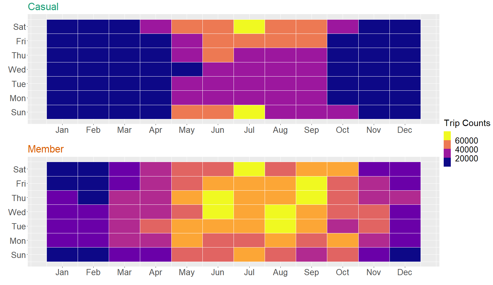
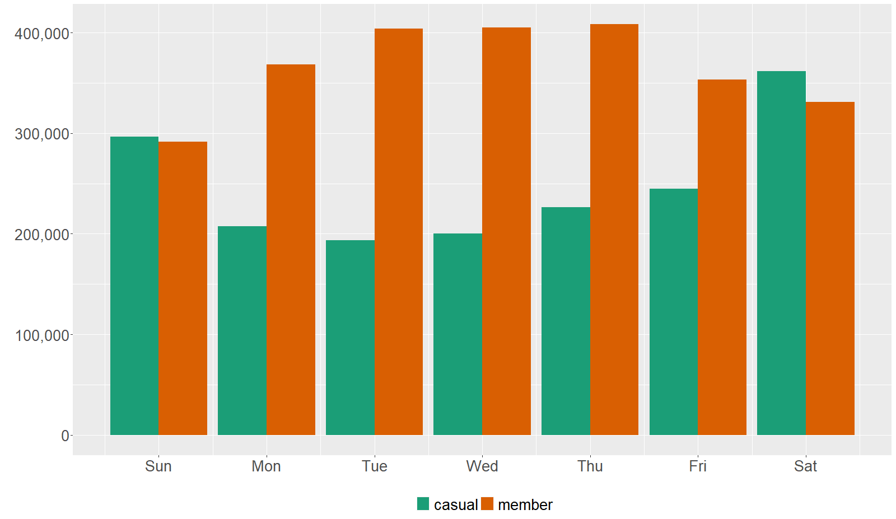
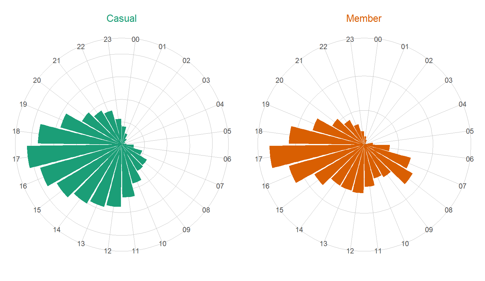
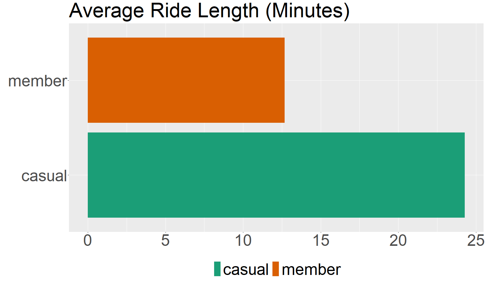
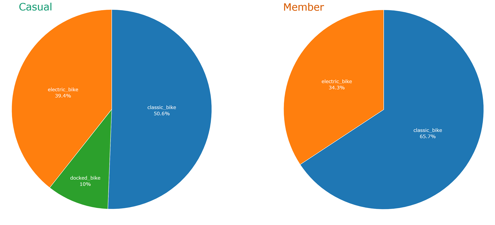

```{r setup, include=FALSE}
knitr::opts_chunk$set(message=FALSE,warning=FALSE, cache=TRUE)
```
<br>
This case study on Cyclistic is my capstone project for Google Data Analytics Professional Certificate Program. My name is Ruddy Setiadi Gunawan, and you can find my report below. <br><br>

# Introduction
<hr>
Cyclistic is a fictional bike-share company in Chicago with over 5,800 bicycles and 600 docking stations. The company launched its bike-sharing offering service in 2016, and it has become popular in the city of Chicago. One of Cyclistic's key features is how its bikes can be unlocked from one station and returned to its any other station anytime. 

Cyclistic customers who purchase single-ride or full-day passes are referred to as casual riders (or casuals), whereas customers who purchase annual memberships are referred to as members. 

As of February 2022, Cyclistic pricing plans are as follow:

- Single-ride: \$1 to unlock, plus \$0.39 per minute
- Full-day pass: \$15/day
- Annual membership: \$10/month

Cyclistic's director of marketing believes the company’s future will depend on maximizing the number of annual memberships. With this objective in mind, the company wants to learn how casual riders and annual members may use Cyclistic services differently, and how to use digital media to convert Cyclistic casual riders to become members.<br><br><br>

# Datasets
<hr>
While Cyclistic is a fictional company, datasets gathered for this analysis come from a real company operating in Chicago called Divvy Bikes.

<a href="https://divvybikes.com/system-data" target="_blank">Divvy trip</a> datasets from January 2022 to December 2022 were used for this analysis.

Each trip includes:

- Trip start day and time 
- Trip end day and time 
- Trip start station 
- Trip end station 
- Rider type

The datasets have been made available under <a href="https://ride.divvybikes.com/data-license-agreement" target="_blank">this license</a><br><br><br>

# Methods
<hr>
The datasets were loaded into RStudio, and then previewed, cleaned, filtered, merged, and analyzed with the help of multiple libraries, such as `skimr`, `tidyverse`, and `lubridate`. As for data visualization, `ggplot2`, `plotly`, `leaflet`, and `rgdal` were all used.

For the sake of my own learning purposes, I also re-analyzed the same datasets using SQL with BigQuery. The analysis results are consistent between SQL and R.

Feel free to check
<a href="https://ru4871sg.github.io/Google-Data-Analytics-Professional-Cyclistic-Capstone/process.html" target="_blank">my data cleaning and analysis process in R</a> as well as the <a href="https://ru4871sg.github.io/Google-Data-Analytics-Professional-Cyclistic-Capstone/misc.html" target="_blank">alternative steps in SQL</a>.<br><br><br>

# Analysis Results
<hr>
### Popular Dates and Days

{width="100%"}
The above data viz shows that both casuals and members like to use Cyclistic bikes between June and September, which are basically the summer months. It is understandable considering bike services are typically more popular during summer time.

However, there is a big difference between casuals and members. Casuals love to use the bikes on Friday to Sunday (weekends), whereas members' busiest days are between Tuesday and Thursday. From this analysis alone, we can see members prefer to use the bikes for daily routines while casuals use Cyclistic more for leisures and hobbies.

To strengthen this narrative, you can check between November and January, where trip counts for casuals go much lower, but trip counts for members still look considerably higher. 

Daily routines (e.g., work commute) don't always change throughout the year, but people may not really use the bikes for leisures and hobbies in the winter months.

To analyze this hypothesis further, let's see how members and casuals compare if we only group the trip counts by the days<br>

{width="90%"}

Here everything looks clearer. Members use Cyclistic bikes more on weekdays, whereas casuals prefer to use them on weekends. This should confirm our previous analysis regarding how casuals use Cyclistic bikes for hobbies and leisures, and how they don't really use Cyclistic bikes for work commute and other weekday routines.<br><br>

### Popular Stations

#### Popular Stations for Casuals:

<iframe height="300" width=85% frameborder="0" scrolling="no" src="vizzes/leaflet_for_station_name_count_casual.html"></iframe>

Above interactive map shows that <b>Streeter Dr & Grand Ave</b> is the most popular station for casuals, much more popular than every other station. Considering that <b>Streeter Dr & Grand Ave</b> is located right next to the Navy Pier, this analysis has proven my point on how casuals use the bikes for leisures and hobbies. The Navy Pier is a tourist attraction in Chicago.<br><br>

#### Popular Stations for Members:

<iframe height="300" width=85% frameborder="0" scrolling="no" src="vizzes/leaflet_for_station_name_count_member.html"></iframe>

The second interactive map shows popular stations for members. Here we can see that <b>Streeter Dr & Grand Ave</b> is not very popular. The most popular stations for members are <b>Kingsbury St & Kinzie St</b>, <b>Clark St & Elm St</b>, and <b>Wells St & Concord Ln</b>. And interestingly, the station counts are more spread out.<br><br>

### Popular Hours

{width="100%"}
From the above data viz, you can see how both casuals and members like to use Cyclistic bikes between 15-18 (3PM - 6PM). 

However, casuals have higher trip counts between 20-22 (8PM - 10PM), whereas members have lower trip counts for the same hours.

On the other hand, morning time (7AM - 9AM) seems to be more popular for members, but not so much for casuals. 

All the findings above have proven our previous hypothesis where members may use the bikes more often for weekday routines, like work commute.<br>

{width="90%"}

Meanwhile, average ride length from casuals and members also differ greatly. Casuals' average ride length in minutes is <b>24.28 minutes</b>, while members' average ride length in minutes is <b>12.68 minutes</b>. 

The fact that casuals (on average) spend much more time with Cyclistic bikes show that casuals often use them to go to far locations. This is understandable because leisure destinations such as Navy Pier may be a bit too far away from the casual riders' starting stations. 

As for members, since they prefer to use the bikes for weekday routines, that explains the shorter ride length.
<br><br>

### Popular Bike Types

{width="100%"}
There is a difference between casuals and members when it comes to bike types. Members like classic bikes much more than electric bikes. As for casuals, they also like classic bikes more than electric, but the gap is not as big as the member group. 

Another interesting find, it looks like all docked bikes were only reserved for casuals in 2022.<br><br><br>

# Recommendations
<hr>

Based on my data analysis result, here are my recommendations for the company:

<b>1. Casual riders should receive email newsletters showing how they can save money</b>

Above analyses prove that casuals often use the bikes for leisure purposes. Average ride length for casuals is 24.28 minutes. That means on average casuals pay \$1 to unlock and \$9.46 for each trip. They can save money by signing up for annual memberships since it will only cost them \$10/month.
 
<b>2. Personalized newsletters to casuals who use the bikes not for leisures</b>

There are still some casuals who may use the bikes for non-leisure purposes. As we can see from the above interactive map, not every casual go to stations close to the Navy Pear. And as we can see from the bar plots, there are also casuals who use the bikes during commute hours and weekdays.

It might be worth it to try a personalized online newsletter campaign to target these groups. They may be interested to sign up for annual membership. You can also try to give them some discounts if they have used the bikes several times.

<b>3. Create interesting digital campaigns around the most popular stations for casuals</b>

You can try to create interesting digital campaigns around the most popular stations for casuals. For example, create a with big banner with QR code "scan me to get a free ride", and put it around <b>Streeter Dr & Grand Ave</b>. 

When you catch the casual riders' attention, they may use their phone to scan the QR code, and this QR code will lead them to a landing page where you give them 15-30 days free trial if they sign up for annual memberships.

You need to use A/B testing to see which campaigns work to attract their attention.